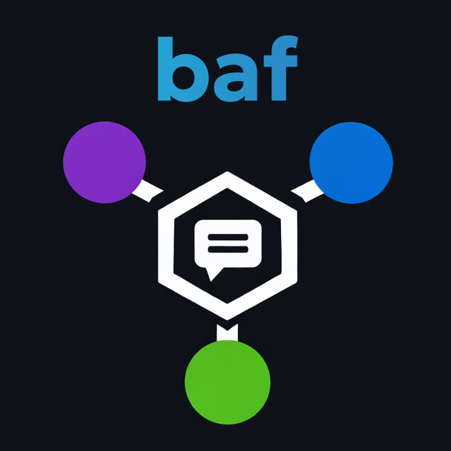
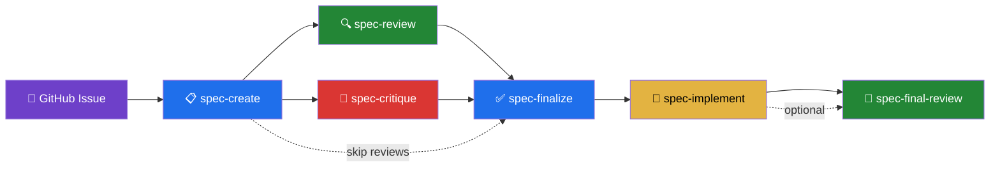

<div align="center">
  
  <h1>Back and Fourth</h1>
  <h3><em>Bring Your Own Agent Framework</em></h3>
  <p><strong>An open-source, LLM-driven development workflow where every conversation is tracked, every decision is recorded, and contributors bring their own AI agents.</strong></p>
</div>

<p align="center">
  <a href="https://github.com/BSpendlove/baf/stargazers"></a>
  <a href="https://github.com/BSpendlove/baf/blob/main/LICENSE"></a>
  <a href="https://github.com/BSpendlove/baf/issues"></a>
  <a href="https://github.com/BSpendlove/baf/pulls"></a>
</p>

<p align="center">
  <a href="#what-is-baf">What is baf?</a> · <a href="#how-it-works">How it works</a> · <a href="#get-started">Get started</a> · <a href="#skills-reference">Skills</a> · <a href="#walkthroughs">Walkthroughs</a> · <a href="context/PROCESS.md">Full process docs</a>
</p>

---

## What is baf?

**baf** is a template repository that turns GitHub issues into structured, AI-driven development workflows. Instead of vibe-coding or unstructured prompting, baf gives your project a repeatable process: spec it, review it, build it — with a full conversation trail on every issue.

The key difference: **contributors bring their own AI agents.** No shared API keys. No hosted service. No vendor lock-in. Open Claude Code, Gemini CLI, Codex, or any agent in the repo, run a skill, and the agent knows exactly what to do.

### The problem

Most AI-assisted development looks like this:
- Someone prompts an agent in a private session
- The reasoning, rejected approaches, and design decisions vanish when the session ends
- The next person (or agent) starts from zero
- There's no audit trail, no accountability, no shared context

### The solution

baf makes AI conversations **first-class artifacts** on your GitHub issues:

```
Human: "What about using Redis for caching?"
Agent: "Redis adds operational complexity. For this use case, an in-memory LRU cache is simpler."
Human: "Good point, but we need cache sharing across instances."
Agent: "Fair — Redis it is. I'll update the spec to include Redis as a dependency."
```

That entire dialogue gets posted to the issue. Every future contributor — human or AI — can read it and understand not just *what* was decided, but *why*.

---

## How it works

### The workflow



> Every conversation — the questions, the debates, the rejected ideas — gets posted to the issue as it happens. The issue becomes the complete decision journal.

### BYOA — Bring Your Own Agent

Contributors use **their own** AI agents with **their own** API keys. baf doesn't touch credentials.

| Agent | Works with baf? | How |
|-------|:-:|------|
| [Claude Code](https://www.anthropic.com/claude-code) | ✅ | Native skills via `.claude/skills/` — first-class support |
| [Gemini CLI](https://github.com/google-gemini/gemini-cli) | ✅ | Read `CLAUDE.md` + `context/PROCESS.md`, run skills manually |
| [Codex CLI](https://github.com/openai/codex) | ✅ | Read `CLAUDE.md` + `context/PROCESS.md`, run skills manually |
| [GitHub Copilot](https://code.visualstudio.com/) | ✅ | Read `CLAUDE.md` + `context/PROCESS.md`, run skills manually |
| [Cursor](https://cursor.sh/) | ✅ | Read `CLAUDE.md` + `context/PROCESS.md`, run skills manually |
| Any agent with file access | ✅ | The workflow is in markdown — any agent can follow it |

**Claude as the orchestrator:** During our testing, Claude produced the best results as the primary agent driving the workflow — it handles spec-create, spec-finalize, and spec-implement, and generates the handoff prompts for other agents. We recommend using Claude Code as the orchestrator that coordinates the full lifecycle, with Gemini and Codex brought in for their specific strengths (review and critique). Any agent *can* run any phase, but Claude as the backbone gives the most coherent end-to-end results.

**How cross-agent handoff works:** Claude Code has native `/slash-command` support via `.claude/skills/`. But the actual instructions live in `context/prompts/` as plain markdown — any agent can read them. When `spec-create` finishes, Claude posts **ready-to-paste prompts** to the GitHub issue that the human can copy directly into Gemini, Codex, or any other agent for the next phase. The human is the bridge between agents; the issue is the shared context.

### Conversation tracking

Every human-agent interaction is captured on the GitHub issue — **as it happens**, not just at the end:

- **Requirements discussions** — "human asked about X, agent proposed Y, human pushed back, settled on Z"
- **Design debates** — approaches considered, trade-offs weighed, choices made
- **Rejections and pivots** — "tried approach A, human said no because of B, went with C"
- **Clarifications** — "human clarified that 'users' means authenticated users only"

The issue becomes a **decision journal** that any future contributor can read to understand the full context.

### Sanitization

All conversation posts are automatically sanitized. The following **never** appear in issue comments:

- API keys, tokens, passwords, secrets
- Email addresses or PII
- Absolute local file paths
- Environment variable values
- Credentials from command outputs

---

## Get started

### Prerequisites

- [`gh` CLI](https://cli.github.com/) installed and authenticated (`gh auth login`)
- [Claude Code](https://www.anthropic.com/claude-code), [Gemini CLI](https://github.com/google-gemini/gemini-cli), [Codex CLI](https://github.com/openai/codex), or any AI agent
- Your own API key for your agent of choice

### 1. Create your repo from this template

```bash
# Option A: Use the GitHub template button
# Click "Use this template" on the repo page, then clone your new repo

# Option B: Clone directly
gh repo create my-project --template BSpendlove/baf --public --clone
cd my-project
```

### 2. Bootstrap the project

Run the bootstrap script once. It cleans up template-specific files (walkthroughs, media, template README), creates a minimal project README, resets `context/SUMMARY.md`, and creates all the GitHub labels:

```bash
./scripts/bootstrap.sh "My Project Name"
```

Then commit the result:

```bash
git add -A && git commit -m "chore: bootstrap baf project"
```

<details>
<summary>What labels are created (click to expand)</summary>

| Label | Color | Purpose |
|-------|-------|---------|
| `approved` | green | Issue approved for work |
| `phase:spec` | blue | Spec is being drafted |
| `phase:review` | blue | Spec is under review |
| `spec:approved` | green | Spec approved for implementation |
| `phase:implementation` | blue | Code is being written |
| `phase:done` | green | Complete — PR merged |
| `priority:p0` | red | Critical path |
| `priority:p1` | orange | Important |
| `priority:p2` | yellow | Nice to have |
| `agents:single` | light blue | Single agent workflow |
| `agents:two` | light blue | Two agents (+ review) |
| `agents:three` | light blue | Three agents (+ review + critique) |
| `agents:full` | light blue | Full pipeline |
| `feature` | teal | New capability |
| `enhancement` | teal | Improvement to existing feature |

> The `bug` label already exists on most GitHub repos by default.

</details>

### 3. Customize for your project (optional)

The bootstrap script handles the basics, but you may want to:

- **Edit `CLAUDE.md`** — add project-specific conventions (language, framework, testing setup)
- **Edit `.github/ISSUE_TEMPLATE/`** — tweak placeholder text to match your domain

### 4. File your first issue

Go to your repo's Issues tab and create one using the **Feature** template. Fill in the what, why, acceptance criteria, and scope boundary. Then add the `approved` label.

### 5. Run your first skill

**Claude Code:**
```bash
claude                    # open Claude Code in the repo
/spec-create 1            # draft spec from issue #1
```

**Gemini CLI / Codex / any other agent:**
```
Read context/PROCESS.md and context/prompts/spec-review.md.
Then review the spec at context/specs/1-my-feature/IMPLEMENTATION_SPEC.md.
Also read all comments on issue #1 for conversation history: gh issue view 1 --json comments
```

You don't have to write these prompts yourself. When `spec-create` finishes, it posts **ready-to-paste prompts** directly to the GitHub issue for each next-phase agent. Just copy and paste into Gemini, Codex, or whatever agent you're using.

### 6. Continue the workflow

After `spec-create`, the issue comment will tell you exactly what to run next:

```bash
/spec-review context/specs/1-my-feature/     # optional: review with Gemini
/spec-critique context/specs/1-my-feature/   # optional: critique with Codex
/spec-finalize context/specs/1-my-feature/   # finalize the spec
/spec-implement context/specs/1-my-feature/  # build it
/spec-status 1                                # check progress anytime
```

Pick the workflow path that fits (see [Skills reference](#-skills-reference)).

---

## Skills reference

Skills are agent-agnostic actions. Each one is a structured set of instructions any AI can follow. The recommended agents are suggestions based on each agent's strengths — not requirements.

| Skill | What it does | Recommended Agent |
|-------|-------------|:-:|
| `/spec-create <issue>` | Read a GitHub issue, analyze the codebase, draft an implementation spec | Claude |
| `/spec-review <path>` | Review a spec for completeness, correctness, best practices | Gemini |
| `/spec-critique <path>` | Critique a spec for architectural gaps, missing edge cases, failure modes | OpenAI / Codex |
| `/spec-finalize <path>` | Incorporate review feedback, write DECISIONS.md, finalize the spec | Claude |
| `/spec-implement <path>` | Implement code from the finalized spec, create a PR | Claude |
| `/spec-final-review <path>` | Post-implementation code review against the spec | Any |
| `/spec-status [issue]` | Show workflow status for a spec or all specs | Any |

### Workflow paths

Pick the path that fits your issue:

```bash
# Full pipeline (complex features)
spec-create → spec-review → spec-critique → spec-finalize → spec-implement → spec-final-review

# Standard (most issues)
spec-create → spec-review → spec-finalize → spec-implement

# Minimal (small changes, bug fixes)
spec-create → spec-finalize → spec-implement

# Trivial (typos, one-liners)
Just fix it and open a PR. Not everything needs a spec.
```

---

## Labels

baf uses GitHub labels to track workflow state. Agents read and update them automatically.

| Label | Meaning |
|-------|---------|
| `approved` | Issue approved, work can begin |
| `phase:spec` | Spec is being drafted |
| `phase:review` | Spec is under review / critique |
| `spec:approved` | Spec finalized, ready for implementation |
| `phase:implementation` | Code is being written |
| `phase:done` | Complete, PR merged |
| `priority:p0` | Critical path |
| `priority:p1` | Important |
| `priority:p2` | Nice to have |

---

## Issue templates

baf includes structured GitHub issue templates that enforce the right fields:

- **Feature** — what, why, acceptance criteria, scope boundary, priority, agent selection
- **Bug** — what happened, reproduction steps, acceptance criteria, complexity
- **Enhancement** — what, why, acceptance criteria, scope boundary, priority, agent selection

---

## Repository structure

```
your-project/
├── CLAUDE.md                          # Agent entry point — read this first
├── context/
│   ├── PROCESS.md                     # Full workflow definition
│   ├── SUMMARY.md                     # Project state tracker
│   ├── prompts/                       # Agent-agnostic instructions (any LLM can read these)
│   │   ├── spec-create.md
│   │   ├── spec-review.md
│   │   ├── spec-critique.md
│   │   ├── spec-finalize.md
│   │   ├── spec-implement.md
│   │   └── spec-final-review.md
│   └── specs/                         # One directory per issue
│       └── <N>-<slug>/
│           ├── IMPLEMENTATION_SPEC.md # The spec
│           ├── README.md              # Status tracker
│           ├── DECISIONS.md           # Accept/reject rationale
│           ├── spec-reviews/          # Review + critique artifacts
│           └── code-reviews/          # Post-implementation reviews
├── scripts/
│   └── bootstrap.sh                  # One-time project setup (removes itself after run)
├── .claude/skills/                    # Claude Code native skills
│   ├── spec-create/SKILL.md
│   ├── spec-review/SKILL.md
│   ├── spec-critique/SKILL.md
│   ├── spec-finalize/SKILL.md
│   ├── spec-implement/SKILL.md
│   ├── spec-final-review/SKILL.md
│   └── spec-status/SKILL.md
└── .github/ISSUE_TEMPLATE/            # Structured issue templates
    ├── feature.yml
    ├── bug.yml
    └── enhancement.yml
```

---

## What makes baf different?

| | Traditional AI dev | baf |
|---|---|---|
| **Conversation history** | Lost when session ends | Every dialogue posted to the issue |
| **Decision rationale** | In someone's head | Recorded in DECISIONS.md + issue comments |
| **Agent handoff** | Start from zero | Next agent reads full context from issue |
| **API keys** | Shared or centralized | Contributors use their own (BYOA) |
| **Process** | Ad-hoc prompting | Structured skills with clear inputs/outputs |
| **Audit trail** | None | Complete trail on every issue |
| **Vendor lock-in** | Tied to one agent | Any agent can follow the workflow |

---

## Walkthroughs

Hands-on guides that walk you through the baf workflow end-to-end. Each one has you create a repo, file an issue, and run the skills — with exercises that have you interact with the agent mid-flow so you can see the conversation tracking and issue comments in action.

### 🧮 Go — CLI Calculator (start here)

The **minimal workflow path** — spec-create → spec-finalize → spec-implement. Single agent (Claude only). Best for learning the basics.

**[Follow the walkthrough →](walkthroughs/go-cli-calculator.md)**

### 📚 Python — Bookstore REST API

The **standard path** with spec-review. Two agents (Claude + Gemini). Shows how agents hand off context through issue comments.

**[Follow the walkthrough →](walkthroughs/python-bookstore-api.md)**

### 🎮 React — Retro Game Hub

The **full three-agent pipeline** — spec-review (Gemini) + spec-critique (Codex) + spec-final-review. Shows the complete multi-agent collaboration.

**[Follow the walkthrough →](walkthroughs/react-retro-game-hub.md)**

---

## Philosophy

1. **Conversations are artifacts.** The dialogue between human and agent is as valuable as the code. Capture it.
2. **Bring your own agent.** No shared keys, no hosted service, no vendor lock-in. Use whatever agent you want.
3. **Structure enables autonomy.** Clear skills with defined inputs/outputs let agents work independently while staying coordinated.
4. **Issues are the source of truth.** Everything traces back to a GitHub issue — the requirement, the spec, the conversation, the code, the PR.
5. **Skills, not scripts.** The workflow is markdown instructions, not code. Any agent that can read can follow it.

---

## Contributing

baf itself uses the baf workflow. To contribute:

1. File an issue using a template
2. Use your own AI agent to work through the skills
3. The issue will have a full record of your conversation and decisions
4. Open a PR when ready

---

## License

[MIT](LICENSE)
