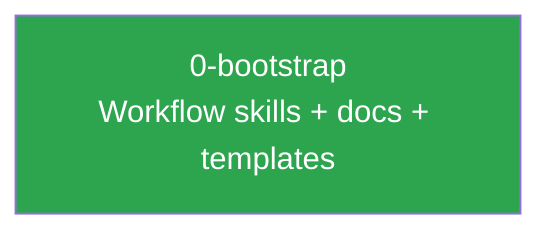

# Project Summary

This file tracks project state. Every agent session should read this before starting new work.

**Updated after every spec is implemented.**

## Current State

This is a template repository for the BYOA (Bring Your Own Agent) workflow framework. It provides Claude Code skills, workflow documentation, and GitHub issue templates that any project can adopt for LLM-driven development.

## Completed Specs

| Spec | Issue | Status | Summary |
|------|-------|--------|---------|
| *(none yet)* | | | |

## Spec Dependencies

Legend: green = complete, blue = in progress, grey = planned

## Key Decisions

*(Decisions that affect future specs will be recorded here as work progresses.)*
